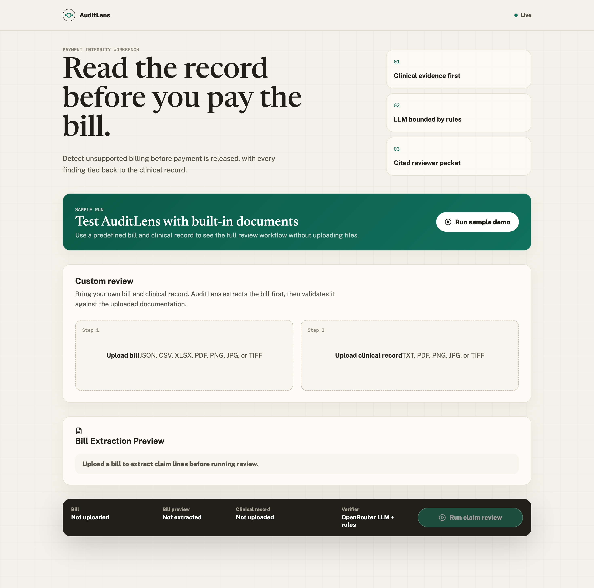
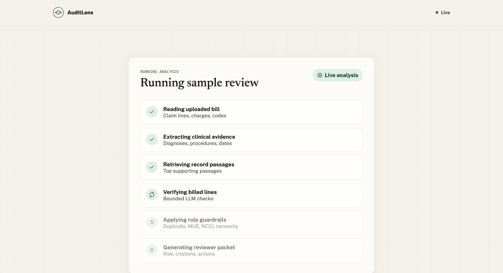
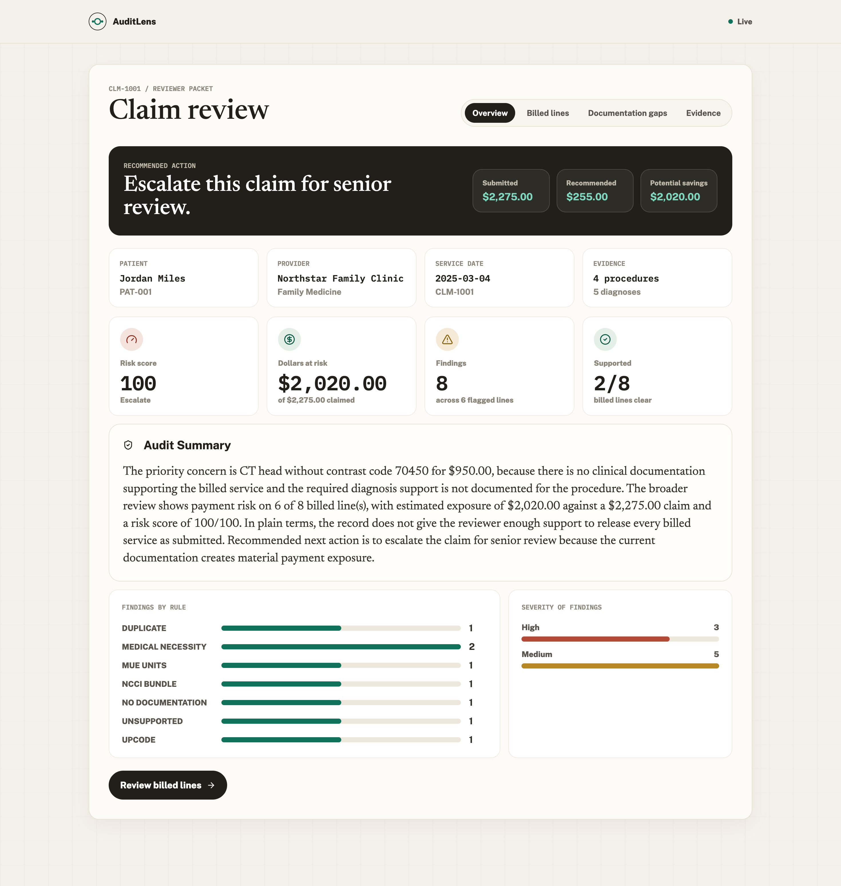
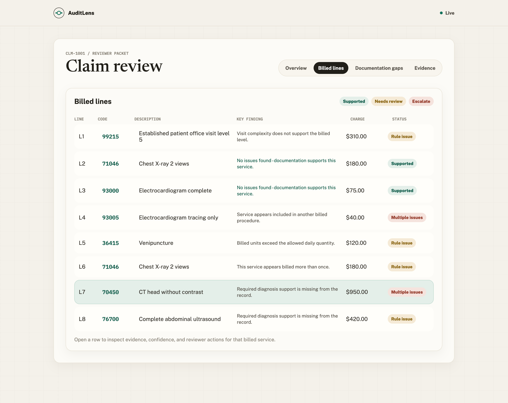
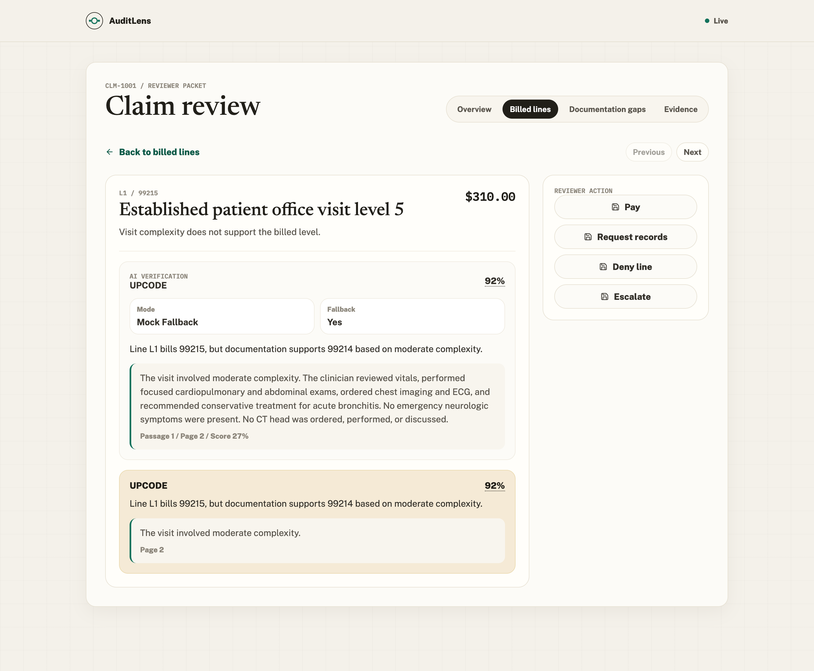
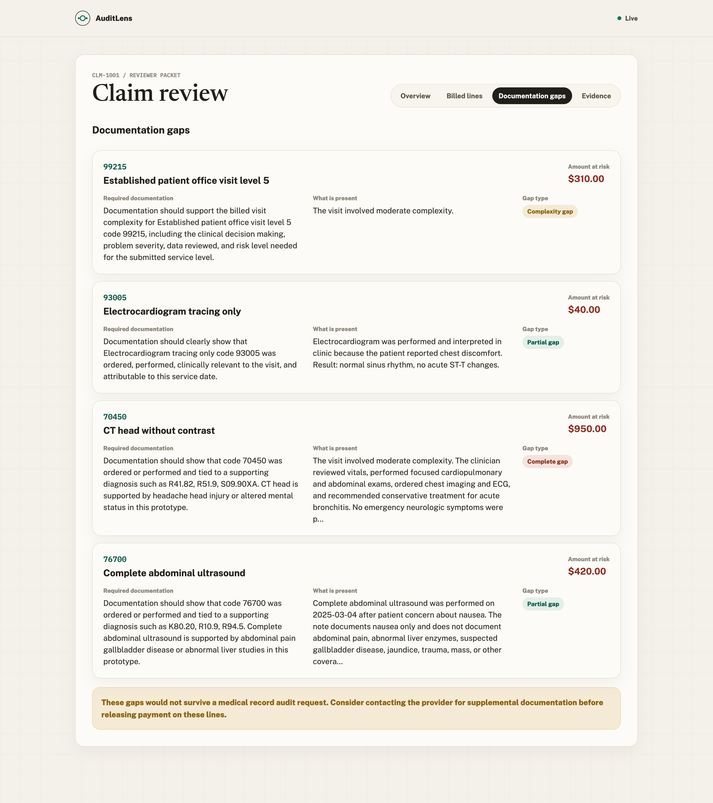
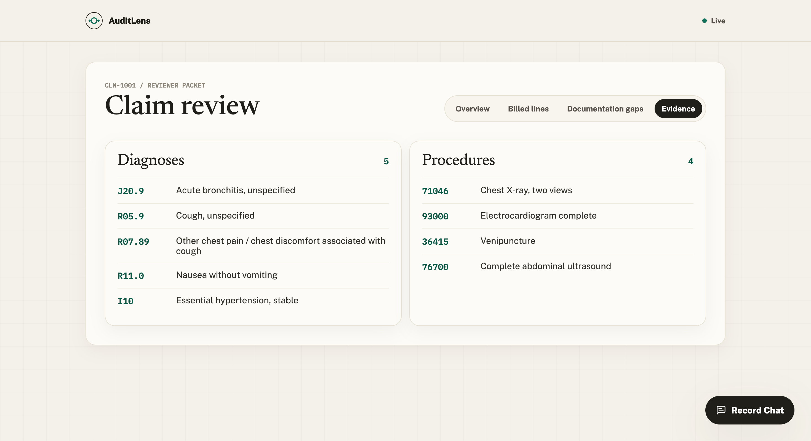

# AuditLens AI

Clinical Claim Validation Workbench - detect unsupported billing before payment is released.

AuditLens AI is a Cotiviti-aligned payment integrity prototype that reviews whether billed medical services are supported by the patient record. A reviewer uploads a bill and clinical documentation, and the system extracts claim lines, checks each billed service against the record and simplified billing rules, then produces a cited reviewer packet with risk scoring, recommended actions, documentation gaps, and grounded record chat.

This project uses synthetic data only. No real PHI is included.



## Why This Project Exists

Healthcare payment integrity teams need to answer one practical question before releasing payment:

> For every billed line, does the medical record prove that the service happened, was medically necessary, and was billed correctly?

A generic LLM can summarize a chart, but payment integrity review needs structured, defensible output. AuditLens treats the LLM as one bounded component inside a larger audit workflow: bills and records are converted into typed objects, relevant record passages are retrieved before verification, deterministic rules catch repeatable billing issues, and every finding is returned with citation, confidence, dollar impact, and reviewer action.

The LLM is a component, not the final decision-maker.

## Core Capabilities

AuditLens accepts bill files in JSON, CSV, XLSX, PDF, PNG, JPG, TIF, and TIFF formats, and clinical records in TXT, PDF, PNG, JPG, TIF, and TIFF formats. It extracts claim metadata, patient and provider details, service dates, CPT/HCPCS codes, descriptions, units, and charges, with OCR support for scanned/image-style bills and records through Tesseract.

The system performs clinical evidence extraction, retrieves relevant record passages for each billed line, verifies support using bounded GenAI with deterministic fallback behavior, and applies rule guardrails for duplicate billing, medically unlikely units, bundled services, diagnosis support, and upcoding patterns. The final report includes line-level flags, citations, confidence transparency, documentation gaps, total billed amount, recommended payment, potential savings, claim risk score, and reviewer actions.

## Product Workflow

A reviewer starts at the claim intake page, runs the built-in sample or uploads a custom bill and clinical record, previews extracted bill lines, and starts the review. AuditLens then shows a live analysis progress screen while it reads the bill, extracts evidence, retrieves passages, verifies billed lines, applies rules, and generates the reviewer packet. The reviewer can scan the claim overview, inspect billed lines, open line-level evidence, review documentation gaps, ask cited record questions, and record line-level actions such as pay, request records, deny line, or escalate.

## Screens

### 1. Claim Intake

The first screen lets the reviewer run a built-in sample demo or upload a custom bill and clinical record. The custom upload path supports realistic document formats rather than only structured JSON.


### 2. Live Claim Analysis Progress

After the review starts, the system shows the active pipeline stages: reading the bill, extracting clinical evidence, retrieving passages, verifying billed lines, applying rules, and generating the reviewer packet.



### 3. Claim Review Overview

The overview screen summarizes the payment decision: submitted amount, recommended payment, potential savings, risk score, supported lines, total findings, and an auditor-style narrative.



### 4. Billed Lines

The billed lines screen makes the claim scannable. Each line shows the code, service, charge, status, key finding, and recommended action.



### 5. Line-Level Evidence Review

The line detail page shows the selected billed service, the AI verification result, cited source passage, confidence, detected issue, and reviewer action options.



### 6. Documentation Gaps

The documentation gaps page explains what documentation is required versus what the record actually contains for problematic billed services.



### 7. Evidence

The evidence page shows extracted clinical facts and supporting passages used by the review process.



## System Architecture

AuditLens is split into a FastAPI backend and a React/Vite frontend.

```text
Uploaded bill + clinical record
        |
        v
Bill parser + OCR/document text extraction
        |
        v
Typed claim lines + extracted clinical evidence
        |
        v
Retrieval over clinical record passages
        |
        v
Bounded line-level AI verification
        |
        v
Deterministic rule guardrails
        |
        v
Aggregation, risk scoring, documentation gaps
        |
        v
Reviewer packet, cited UI, record chat, stored artifacts
```

## Backend Pipeline

The bill intake pipeline supports strict structured JSON, flexible patient-bill JSON layouts, clean CSV/XLSX tables, mixed document-style CSV/XLSX workbooks with embedded CPT tables, and PDF/image bills through text extraction and OCR-assisted parsing. All formats are normalized into a typed `Claim` object containing patient, provider, service date, and line items.

The clinical record pipeline accepts text notes, digital PDFs, and scanned/image records. Extracted text is used for clinical fact extraction, retrieval, cited verification, documentation-gap summaries, and record chat. When available, the extraction layer identifies diagnoses, procedures, service dates, visit complexity, source spans, and page/location metadata.

For each billed line, AuditLens builds a focused query using the code and service description, retrieves the most relevant passages from the record, and asks a narrow verification question: does this evidence support this specific billed service? Deterministic guardrails then check duplicate lines, excessive units, bundled code pairs, medical necessity, and upcoding/complexity mismatch patterns. The aggregation layer combines everything into line statuses, flags, citations, confidence breakdowns, documentation gaps, claim narrative, risk score, recommended payment, potential savings, and reviewer action.

## Frontend Experience

The frontend is a React/Vite reviewer workbench built around the claim-validation workflow: intake, bill extraction preview, live processing, claim overview, billed-line scanning, line-level evidence review, documentation gap review, evidence review, and floating cited record chat. The UI intentionally avoids a chatbot-first experience; the primary product is a structured claim review workflow, with chat as a supporting evidence tool.

## Tech Stack

| Layer | Technology |
|---|---|
| Frontend | React, Vite, Recharts, Lucide icons |
| Backend | FastAPI, Pydantic |
| Data storage | SQLite |
| OCR | Tesseract via pytesseract |
| PDF/text extraction | pdfplumber |
| Spreadsheet parsing | pandas, openpyxl |
| GenAI | OpenRouter-compatible chat completion API |
| Rules | CSV reference tables and deterministic Python checks |

## Project Structure

```text
AuditLens-AI/
  backend/
    app/
      main.py                  # FastAPI app and API routes
      schemas.py               # Pydantic data contracts
      db.py                    # SQLite persistence
      pipeline/
        aggregate.py           # risk score, narrative, documentation gaps
        bill_parser.py         # JSON/CSV/XLSX/PDF/image bill intake
        chat.py                # cited record chat
        extraction.py          # clinical evidence extraction
        ocr.py                 # PDF/image/text extraction
        retrieval.py           # record passage retrieval
        rules.py               # deterministic billing checks
        verify.py              # bounded line-level verification
    tests/
    requirements.txt
  frontend/
    src/
      App.jsx
      api.js
      styles.css
    package.json
  data/
    samples/                   # primary synthetic claim and record
    demo_cases/                # additional synthetic upload cases
    reference/                 # simplified rules and code descriptions
  eval/
    generated_cases/           # labeled synthetic evaluation cases
    results/                   # precomputed metrics and reports
    run_evaluation.py
  assets/
    screenshots/               # README screenshots
  README.md
```

## Demo Data

The repository includes synthetic claim packets in multiple formats, including JSON, CSV, XLSX, PDF, and scanned image-style records. The built-in sample and demo cases include planted issues such as duplicate lines, excessive units, unsupported billed services, bundled service pairs, procedures without supporting diagnoses, and upcoding/visit complexity mismatches.

## Development Note

For research, debugging support, and to better understand implementation details, I used AI tools such as Codex, ChatGPT, and Claude during parts of the development process.
